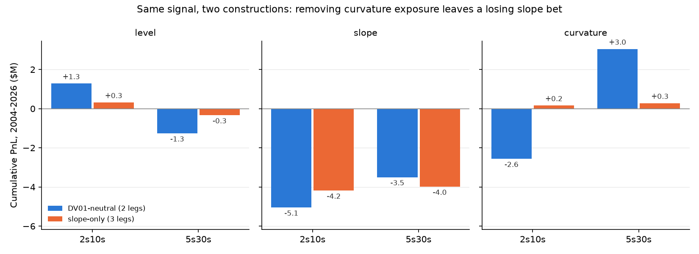
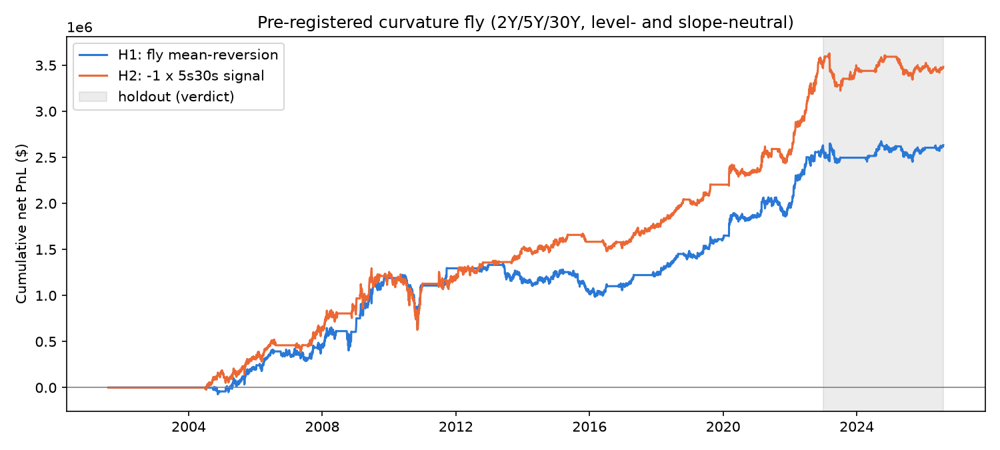

# Treasury Curve Relative-Value Strategy

## Overview
A systematic Treasury yield curve relative-value strategy that trades curve
spreads (2s10s, 5s30s) using a mean-reversion signal, constructed to be
DV01-neutral to parallel yield curve shifts. Strategy performance is
backtested and PnL is attributed to curve risk factors (level, slope,
curvature) via PCA decomposition.

## Results at a glance
**The strategy as specified doesn't make money, and the attribution shows
why.** The rest of this README is the step-by-step record; this section
is the summary.

1. **The baseline loses over 25 years** (2s10s -$6.32M, Sharpe -0.46;
   5s30s -$1.81M, Sharpe -0.14). Most of the loss comes from a few trades
   entered at the start of secular Fed regime shifts (2004-06, 2007-08,
   2021-23), which a trailing 1-year z-score reads as "extreme" when they're
   actually the start of a trend.
2. **Risk controls and a credit hedge help, but the gain doesn't survive
   scrutiny.** Stop-loss + max-hold (with a re-entry cooldown) plus a
   credit-stress hedge lift 5s30s to +$2.81M (Sharpe 0.20). Remove the
   hedge's single 2007-09 GFC activation and it's flat (-$0.05M).
3. **The intended slope bet loses money everywhere.** PCA attribution
   shows slope PnL negative in both pairs and in every regime. The 5s30s
   trade's profits came from *unintended* curvature exposure (+$3.53M),
   because DV01-neutral legs aren't factor-neutral.
4. **Removing that side exposure confirms it.** A 3-leg trade sized to
   zero level and curvature exposure (same signal, same slope exposure)
   loses -$3.8M / -$4.4M (Sharpe -0.34 / -0.40); its slope PnL is
   -$4.2M / -$4.0M, essentially unchanged from the 2-leg trade.
5. **The curvature idea doesn't hold up out of sample.** A curvature
   fly, with its rules [pre-registered](docs/curvature_preregistration.md)
   before running it, earned Sharpe 0.63 before 2023 and 0.08 (+$52k) on the
   2023-26 holdout: a technical pass of a deliberately weak bar, but
   indistinguishable from zero. The variant closest to what actually made
   money in the backtest failed outright (-$36k).

| | 2s10s | 5s30s |
|---|---|---|
| Baseline (DV01-neutral, z-score) | -$6.32M / -0.46 | -$1.81M / -0.14 |
| + risk controls | -$4.61M / -0.41 | +$0.58M / +0.05 |
| + risk controls + credit hedge | -$2.39M / -0.17 | +$2.81M / +0.20 |
| ...ex-GFC hedge activation | -$5.24M / -0.40 | -$0.05M / -0.00 |
| Slope-only, 3 legs (2004-26) | -$3.84M / -0.34 | -$4.41M / -0.40 |

*Net PnL / annualized Sharpe, $10k DV01 per leg, 0.5bp costs.*




**Takeaway:** a naive z-score mean-reversion on 2s10s/5s30s has no
demonstrable edge in 2001-2026 Treasuries, and the apparent edges found
along the way (a GFC tail hedge, a curvature side bet) look like
small-sample luck once tested properly. Methodologically the useful parts
are the exact PCA attribution, factor-neutral construction, and the
discipline of pre-registering the follow-up hypothesis rather than
mining the same 25 years for it.

## Goals
- Demonstrate systematic signal construction, relative-value trade design,
  and PnL attribution methodology relevant to rates trading.
- Support configurable spread selection (2s10s vs 5s30s) using the same
  pipeline.

## Data
- Source: FRED (Federal Reserve Economic Data)
- Series: 2Y, 5Y, 10Y, 30Y Treasury constant maturity yields; Moody's
  Seasoned Baa Corporate Bond Yield (DBAA), used to derive a Baa-10Y credit
  spread for the credit hedge overlay (see below)
- History: 25 years of daily data (back to 2001), covering the GFC, the
  2020 zero-rate period, and the 2022-23 hiking cycle

## Methodology

### 1. Factor Decomposition (PCA)
- Run PCA on historical daily changes in the 4 yield curve points
- Extract level, slope, and curvature factors
- Validate against expected variance explained (level ~80-90%, slope
  ~5-10%, curvature ~2-5%)

### 2. Signal Construction (Mean-Reversion)
- Compute the target spread (2s10s or 5s30s) daily
- Compute a rolling z-score of the spread (default window: 252 trading days)
- Entry/exit rules based on z-score thresholds (e.g., enter steepener when
  z < -1.5, enter flattener when z > 1.5, exit when z reverts toward 0)
- Signal logic should be modular so alternative signals (e.g., momentum)
  can be swapped in later

### 3. Position Construction (DV01-Neutral)
- Two-leg position: long duration exposure at one curve point, short
  duration exposure at the other
- Size legs so net DV01 exposure to a parallel shift is ~0
- Approximate DV01 per leg using standard bond duration/DV01 formulas

### 4. Backtest
- Simulate strategy over historical data using the signal + position
  construction above
- Track daily PnL, cumulative PnL, drawdowns
- Report: Sharpe ratio, max drawdown, win rate, cumulative PnL chart

### 5. PnL Attribution
- Decompose realized strategy PnL into contributions from level, slope,
  and curvature factors (using PCA loadings from step 1)
- Visualize as a stacked/breakdown chart over time

### 6. Credit Hedge Overlay (extension, not in original spec)
- Short a Baa-10Y credit-spread-duration position, triggered only when the
  credit spread's own rolling z-score signals stress (same mean-reversion
  machinery as step 2, applied to a different series, one-sided)
- Modeled as a spread-isolated exposure (credit-spread duration only, not
  full corporate-bond total return) so it doesn't double up on the rates
  risk the curve legs already carry
- Added after the curve-only backtest showed most lifetime losses came
  from three regime shifts (2004-06, 2007-08, 2021-23); see Progress Notes
  for whether it actually helps and the important caveat on why

### 7. Risk Controls: Max-Hold + Stop-Loss (extension, not in original spec)
- Force-exit a trade after `max_hold_days` (default 252, matching the
  z-score's own lookback window) regardless of z-score
- Force-exit if cumulative realized PnL since entry drops below
  `-stop_loss_dollars` (default $500k), regardless of z-score
- A stop-loss alone whipsaws (see Progress Notes) -- fixed with a re-entry
  cooldown requiring the z-score to retrace halfway back toward exit_z
  before re-entering the same direction

## Project Structure
```
curve-strategy/
├── README.md
├── data/              # raw and processed yield curve data
├── src/
│   ├── data_loader.py     # pulls/cleans FRED data (Treasury yields + Baa credit spread)
│   ├── pca_factors.py     # PCA decomposition of curve moves
│   ├── signal.py          # z-score mean-reversion signal (spread-agnostic)
│   ├── positions.py       # DV01-neutral position sizing, banded rebalancing
│   ├── backtest.py        # backtest engine, curve-only and combined w/ credit hedge
│   ├── credit_hedge.py    # credit-stress hedge overlay (extension, see step 6)
│   ├── risk_controls.py   # max-hold + stop-loss w/ cooldown (extension, see step 7)
│   ├── full_stack.py      # risk controls + credit hedge combined
│   ├── factor_trades.py   # PCA-factor-sized multi-leg trades: slope-only, curvature fly
│   └── attribution.py     # PnL attribution by factor
├── docs/              # curvature test pre-registration
├── notebooks/         # exploratory analysis (optional)
├── outputs/           # charts, results
└── requirements.txt
```

## Status
- [x] Data pipeline (FRED pull + cleaning)
- [x] PCA factor decomposition
- [x] Signal construction
- [x] DV01-neutral position sizing
- [x] Backtest engine
- [x] PnL attribution
- [x] Run for both 2s10s and 5s30s, compare results
- [x] Credit hedge overlay (extension) + honest evaluation
- [x] Risk controls: max-hold + stop-loss w/ cooldown (extension)
- [x] Combine risk controls + credit hedge overlay together
- [x] Factor-neutral (slope-only) construction
- [x] Pre-registered curvature test on 2023+ holdout
- [x] Charts + writeup

## Progress Notes

### Data pipeline (`src/data_loader.py`)
Pulls daily 2Y/5Y/10Y/30Y Treasury constant maturity yields (FRED series
DGS2/DGS5/DGS10/DGS30) via `fredapi`, forward-fills short gaps (e.g. single
holidays), and drops any remaining incomplete rows. Currently configured for
25 years of history (back to 2001), covering the GFC, the 2020 zero-rate
period, and the 2022-23 hiking cycle. Output: `data/treasury_yields.csv`
(6,521 rows, 2001-08-02 to 2026-07-30, no missing values).

### PCA factor decomposition (`src/pca_factors.py`)
PCA on daily yield changes (in bps, unstandardized covariance) recovers the
expected level/slope/curvature structure:

| Factor | Variance explained | Expected range |
|---|---|---|
| Level | 86.8% | 80-90% |
| Slope | 10.8% | 5-10% |
| Curvature | 1.9% | 2-5% |

Level lands squarely in range; slope/curvature are marginally outside the
textbook range, plausibly because the sample includes several large
parallel-shift regimes (GFC, 2020 crash) that reinforce the level factor.
Loadings confirm correct factor shapes: level loads positively and evenly
across all maturities, slope is monotonic from 2Y to 30Y, and curvature
shows the classic belly-vs-wings hump. Outputs: `data/pca_loadings.csv`,
`data/pca_factor_scores.csv` (daily factor scores, used later for PnL
attribution), `outputs/pca_factors.png`.

### Signal construction (`src/signal.py`)
Rolling 252-day z-score of the spread (long-maturity minus short-maturity
yield, in bps), with stateful entry/exit: enter steepener at z <= -1.5,
flattener at z >= +1.5, hold until z reverts through 0 (a position isn't
re-evaluated against the entry threshold every bar, so it doesn't flicker at
the boundary).

| Pair | Trades | % time in position | Steepener / Flattener |
|---|---|---|---|
| 2s10s | 26 | 76.1% | 39.2% / 36.9% |
| 5s30s | 32 | 71.4% | 37.1% / 34.3% |

**What the trades are showing:** hold durations are wide and long-tailed
(2s10s median 201 days, max 692 days). That's a direct consequence of the
25-year sample containing several multi-year curve regimes — the 2019
near-inversion bled into the 2020 zero-rate period, and the 2022-23 hiking
cycle kept the curve deeply inverted for an extended stretch — during which
the spread can sit multiple standard deviations from its trailing 1-year
mean for a long time before reverting. Verified directly: through
Aug-Sep 2019 the signal holds a steepener continuously as the z-score
grinds from -0.8 to -3.7 without ever crossing back through 0.

**Expected outcome once backtest/positions are built:** this is a slow,
low-turnover positioning strategy, not a fast mean-reversion scalper — only
26-32 trades total per spread over 25 years. Once DV01-neutral sizing
(`positions.py`) is in place, PnL on each trade should come predominantly
from the slope factor reverting (curve steepening/flattening back toward
its trailing mean) rather than from the overall level of rates, since the
position is explicitly hedged against parallel shifts. The PCA attribution
step (step 5) is what will confirm that empirically. One structural
limitation worth flagging now: with so few discrete trades, performance
metrics from the eventual backtest (Sharpe, win rate) will have wide
statistical uncertainty regardless of how the sample is split — see the
in-sample/out-of-sample note below.

**In-sample vs. out-of-sample:** the z-score itself is already
point-in-time correct — it's a trailing rolling window, so it never uses
future data at any given date, unlike a model fit once on the full history.
The real lookahead risk would only appear if we later *tune* entry_z /
exit_z / window against full-history backtest performance; the current
defaults are fixed a priori from the literature convention in this spec,
not fitted. Given the low trade count above, a hard chronological
train/test split would leave very few trades in either bucket to draw
conclusions from. Current plan: keep thresholds fixed (no tuning) through
`backtest.py`, and reserve the most recent few years as an untouched
holdout for final validation rather than for any parameter selection —
revisit if we ever want to grid-search thresholds.

### Position sizing (`src/positions.py`)
Each leg's DV01 uses the closed-form semiannual par-bond modified-duration
formula, exact here since CMT yields are by definition par-bond yields.
Notional is **fixed at trade entry, not recomputed daily** — a real curve
trade isn't continuously re-hedged. Legs are re-sized (a "banded rebalance")
only once either leg's modified duration has drifted more than 0.1 years
since the last sizing event, with a transaction cost (0.5bp of notional
traded, an approximation of on-the-run Treasury bid/ask) charged on every
entry, rebalance, and exit.

That 0.1-year band behaves very differently across the two pairs, because
duration convexity scales sharply with maturity — a 30Y yield move of just
~10bp shifts its modified duration by ~0.17 years, vs ~0.04yr for 10Y and
~0.01yr for 5Y for a similar move. Result: 2s10s rebalances ~235 times over
25 years (~once/21 days while in a trade, the band works as intended);
5s30s rebalances ~1,738 times (~once/2.7 days while in a trade — barely
different from continuous rebalancing, largely defeating the point of a
band). **Not yet revisited** — a maturity-scaled threshold (e.g. a
dollar-DV01-mismatch band instead of a flat duration-years band) would fix
this asymmetry; flagged here for future work.

Validated: DV01s match exactly at every sizing event (parallel-shift check
nets to $0.000000), confirming no sign errors in how the two legs combine.

### Backtest (`src/backtest.py`)
Daily PnL uses each leg's *actual* currently-held DV01 (fixed notional ×
that day's duration-implied per-unit DV01), not an idealized constant — so
the drift `positions.py` introduces between rebalances flows through into
realized PnL. The position/DV01 driving day t's PnL is lagged by one day
(a signal from day t's close can't be traded until day t+1) to avoid
lookahead.

| Pair | Net PnL (25y) | Sharpe | Max drawdown | Trades | Win rate |
|---|---|---|---|---|---|
| 2s10s | -$6.32M | -0.46 | -$7.15M | 26 | 57.7% |
| 5s30s | -$1.94M | -0.15 | -$3.40M | 32 | 65.6% |

**The core finding: this strategy, as designed, loses money over 25 years
— and it's not random noise.** Win rate is majority-positive for both
pairs (58-66% of trades win), but a handful of catastrophic trades wipe out
the gains. Sorting trades by outcome, the worst ones cluster exactly on
three known secular Fed regime shifts, not randomly in time:

| Pair | Entry | Direction | Held | Spread move | PnL |
|---|---|---|---|---|---|
| 2s10s | 2004-05-27 | steepener | 692d | 214→18bp | -196bp |
| 2s10s | 2007-06-07 | flattener | 559d | 8→147bp | -139bp |
| 2s10s | 2021-12-01 | steepener | 519d | 87→-38bp | -125bp |
| 5s30s | 2004-04-14 | steepener | 847d | 182→19bp | -163bp |
| 5s30s | 2021-08-18 | steepener | 518d | 112→11bp | -101bp |

The signal enters believing the spread is "extreme relative to its
trailing 252-day norm" — but each of these was the *start* of a multi-year
secular trend (2004-06 hiking into the pre-GFC inversion, the 2007-08 GFC
steepening, the 2021-23 hiking cycle's historic inversion), not noise
around a stable mean. A trailing 1-year lookback has no way to know the
curve is about to move 3-4x further than "extreme" and keep going for over
a year. This is the classic failure mode of naive mean-reversion on a slow
macro variable: fine in range-bound regimes, picked off hard exactly when
a real regime shift starts. Visually confirmed in
`outputs/backtest_{pair}.png` — cumulative PnL is a staircase down with
discrete cliffs at each regime shift and no real recovery in between.

### Credit hedge overlay (`src/credit_hedge.py`) — extension beyond the original spec
Motivated by the regime-shift finding above: checked whether Baa-10Y
credit spread widened during each of the five losing trades. Mixed
picture — it blew out during the 2007-08 GFC trades (+442bp) but actually
*tightened* during the 2004-06 hiking cycle (-35bp), since that was a
routine tightening in a healthy economy, not a credit event. An always-on
short-credit overlay would therefore help in one regime and hurt in
another, so the hedge instead triggers only off the credit spread's own
rolling z-score (>=1.5 to activate, reverts through 0 to deactivate) —
same one-sided banded-rebalance sizing convention as `positions.py`, sized
as a spread-isolated exposure (duration to the OAS component only, since
the curve legs already carry the rates risk).

| Pair | Curve-only net PnL | + credit hedge | Sharpe (curve-only → combined) | Max drawdown (curve-only → combined) |
|---|---|---|---|---|
| 2s10s | -$6.32M | **-$4.10M** | -0.46 → -0.26 | -$7.15M → -$5.48M |
| 5s30s | -$1.81M | **+$0.41M** | -0.14 → +0.03 | -$3.40M → -$3.93M |

5s30s's max drawdown technically worsens in dollar terms, but that's a
peak-relative artifact — the combined book reaches a much higher peak
(~+$3.4M in 2020) before giving some back, and sits above the curve-only
line at literally every point in the chart after 2008
(`outputs/backtest_{pair}_with_credit_hedge.png`). Not a real
deterioration, just a wider swing around a much better level.

**The important caveat — this needs to be the headline, not a footnote:**
almost the entire positive value of the hedge is one trade. The
2007-07-26 → 2009-05-21 GFC activation alone contributed +$2,854,461; the
other 12 activations across 25 years combined for **-$632,717**. Take away
that single trade and the hedge, ex-GFC, is a net loser. Its entire value
depends on one historical tail event landing inside the 25-year sample —
this is the same small-sample fragility flagged for the curve trades
themselves (see in-sample/out-of-sample note above), but sharper: n=1 for
the event that makes the whole overlay work. **The honest framing is "this
hedge would have saved this specific historical backtest, entirely because
it caught 2008" — not "this hedge reliably improves the strategy."**
Whether it earns its keep going forward depends on how often a comparable
credit event recurs and whether the z-score trigger catches it as cleanly
next time, which this backtest cannot tell us.

### Risk controls: max-hold + stop-loss (`src/risk_controls.py`) — extension beyond the original spec
Direct response to Known Limitations item 1 below. `backtest.py`'s pipeline
is three sequential passes (signal → positions → PnL), but a stop-loss
needs to know today's realized dollar PnL to decide whether to exit
tomorrow, which needs sizing, which needs to already be in the trade —
so this module re-does all three steps as a single day-by-day walk instead
of three passes. **Validated the merge first**: with both controls off, it
reproduces `backtest.py`'s numbers exactly (max diff $0.000000) before
trusting any new results with the controls on.

First pass (max-hold=252 days, stop-loss=$500k, no cooldown) gave a mixed,
partly negative result: 2s10s got *worse* (-$6.32M → -$6.60M) while 5s30s
improved (-$1.81M → -$1.52M). Root cause, found by inspecting individual
exits: **93-95% of stop-loss exits were immediately re-entering the same
direction the very next trading day**, because the z-score doesn't know a
stop just fired — if it's still past the entry threshold, the position
just walks right back in. This doesn't reduce exposure to the secular move
that triggered the stop at all, it just resets the loss counter to zero
while paying an extra transaction-cost round-trip (costs nearly doubled:
2s10s $163k→$296k, 5s30s $93k→$134k).

Fixed with a re-entry cooldown: after a stop-loss, require the z-score to
retrace at least halfway back toward exit_z before re-entering the *same*
direction (the opposite direction is never blocked — that's a distinct new
bet, not a continuation of the one that just got stopped out). This took
immediate re-entries to zero and produced a clean improvement:

| Pair | Baseline | + risk controls (w/ cooldown) | Sharpe | Max drawdown |
|---|---|---|---|---|
| 2s10s | -$6.32M | **-$4.61M** | -0.46 → -0.41 | -$7.15M → -$5.47M |
| 5s30s | -$1.81M | **+$0.58M** | -0.14 → **+0.05** | -$3.40M → -$2.47M |

Confirmed directly on the 2004-06 5s30s disaster trade: with the cooldown,
the stop-loss fired in Nov 2004 and the position stayed locked out of
re-entering until Dec 2005 — over a year sitting out most of the ongoing
decline — instead of riding it the whole way down as in the baseline.
`outputs/backtest_{pair}_with_risk_controls.png` shows the risk-controlled
line sitting above baseline for the entire 25-year history in both pairs.
2s10s is still a net loser even with controls; 5s30s is not.

### Full stack (`src/full_stack.py`)
Risk-controlled curve trade + credit hedge, run together. First, the
credit hedge got the same day-by-day treatment as the curve legs
(`credit_hedge.simulate_hedge`, validated to reproduce the original hedge
exactly with the stop off) so it could take a stop-loss + cooldown.
**It doesn't need one:** the hedge's worst single activation lost $342k,
so a $500k stop never fires, and even a $250k stop fires once with no
whipsaw. The hedge's ex-GFC losses are a slow bleed across many small
activations (9 losers between -$51k and -$342k), not a tail a stop can cut.

| Pair | Baseline | + risk controls | + risk controls + credit hedge | Full stack, ex-GFC hedge activation |
|---|---|---|---|---|
| 2s10s | -$6.32M (Sharpe -0.46) | -$4.61M (-0.41) | **-$2.39M (-0.17)** | -$5.24M (-0.40) |
| 5s30s | -$1.81M (-0.14) | +$0.58M (+0.05) | **+$2.81M (+0.20)** | -$0.05M (-0.00) |

The two extensions stack roughly additively (daily curve-vs-hedge PnL
correlation is ~-0.07), but the last column is the honest read: take out
the single 2007-09 hedge activation and the best variant, 5s30s, is flat
over 25 years. The full stack's max drawdown is also *worse* than risk
controls alone in both pairs: the hedge's gains lift the peak (the GFC
payoff for 2s10s, the March-2020 activation for 5s30s) and its later
give-back and bleeding then add to the curve losses (hedge -$1.87M of the
2s10s drawdown from Dec 2008 to Feb 2026, -$2.04M of the 5s30s drawdown
from Mar 2020 to Sep 2022). `outputs/backtest_{pair}_full_stack.png`.

### PnL attribution (`src/attribution.py`)
Each day's yield-change vector is decomposed exactly as dy = mu + L·f
(4-maturity, 4-component PCA, so no approximation), and the position's
gross PnL e·dy splits into f_k·(e·L_k) per factor, where e is the signed
$ DV01 per maturity held from the prior close. Reconciles to backtest net
PnL to the cent. The PCA was refit on the current yield data, since the
committed factor scores pre-dated the data refresh in the backtest commit.

| Pair (baseline) | Level | **Slope** | **Curvature** | Residual + drift | Costs | Total |
|---|---|---|---|---|---|---|
| 2s10s | +$1.40M | **-$4.84M** | **-$2.71M** | -$0.01M | -$0.16M | -$6.32M |
| 5s30s | -$1.37M | **-$4.07M** | **+$3.53M** | +$0.19M | -$0.09M | -$1.81M |

**The core finding: the slope bet, the one the strategy exists to make,
loses money in both pairs and in every regime** (2001-06, 2007-09,
2010-19, 2020-26 all negative for both). Whatever positive PnL the
strategy has comes from exposures it didn't intend to take:

- **DV01-neutral is not factor-neutral.** While in a trade, the average
  curvature exposure is 0.94x the slope exposure for 2s10s and 1.25x for
  5s30s. 5s30s is, by PCA, *more* of a curvature trade than a slope trade:
  5Y loads +0.54 on curvature and 30Y -0.54, so a 5s30s steepener is also a
  large short-belly bet.
- **5s30s's curvature leg earned +$3.53M, positive in every regime** --
  it's the only consistently positive line in either pair, and the reason
  5s30s does better than 2s10s at all. For 2s10s the curvature exposure has
  the opposite sign and loses (-$2.71M).
- **Level exposure isn't zero either** (0.09-0.14x slope): equal DV01 on
  each leg isn't the same as equal *PCA level* loading (2Y loads 0.45 on
  level, 10Y 0.53), so the 2s10s trade carries a small residual
  duration bet that happened to earn +$1.40M.

The full-stack attribution tells the same story: risk controls shrink the
slope losses (2s10s -$4.84M -> -$2.59M, 5s30s -$4.07M -> -$1.07M) by
cutting the regime-shift trades short, but don't turn slope positive.
Charts: `outputs/attribution_{pair}_{baseline,full_stack}.png`.

**What this means for next steps:** the obvious temptation is to "trade
the curvature instead", e.g. a 5s/30s-vs-belly butterfly. That would be a
hypothesis *found by looking at this backtest*, so testing it on the same
25 years would be in-sample by construction. If pursued, it needs to be
specified up front and judged on the recent-years holdout, per the
in-sample/out-of-sample plan above. Caveat on the attribution itself:
the PCA loadings are fit on the full sample, which is fine for after-the-fact
attribution but would be lookahead if they ever drove positions.

### Slope-only construction (`src/factor_trades.py`)
Same z-score signal, but legs sized in PCA factor space: three maturities,
solved so exposure to level and curvature is zero and slope exposure
equals the DV01-neutral trade's at every sizing date. Because these
loadings now drive positions, they come from a **trailing 3-year PCA**
(no lookahead), which limits the test to 2004-06-29 onward. The third leg
was chosen on construction quality alone, before looking at any PnL:
2s10s adds the 30Y, 5s30s adds the 2Y (the alternatives needed 2-4x the
gross DV01 and left 4-16x more exposure to the unhedged 4th PC). Both
constructions run through one simulator with identical conventions
(re-size every 21 days, 0.5bp costs, 1-day lag), so construction is the
only difference.

| Pair | Construction | Net PnL | Sharpe | Level | Slope | Curvature |
|---|---|---|---|---|---|---|
| 2s10s | DV01-neutral | -$6.48M | -0.48 | +$1.28M | -$5.05M | -$2.57M |
| 2s10s | slope-only | -$3.84M | -0.34 | +$0.32M | -$4.19M | +$0.16M |
| 5s30s | DV01-neutral | -$1.59M | -0.13 | -$1.27M | -$3.50M | +$3.05M |
| 5s30s | slope-only | -$4.41M | -0.40 | -$0.34M | -$3.99M | +$0.28M |

The construction does what it should: curvature PnL drops from ~$3M to
~$0.2M (the remainder is the gap between trailing and full-sample
loadings). With it gone, the slope bet is all that's left, and it loses
about $4M in both pairs. 2s10s improves only because it sheds a curvature
exposure that happened to lose; 5s30s gets worse because it sheds the one
that happened to win.

One existing doc bug fixed along the way: `pca_factors._orient_signs`
described a rising curvature score as the belly "richening"; with positive
belly loadings it means belly yields rose, i.e. the belly cheapened. The
code was right, only the comment was wrong.

### Pre-registered curvature test (`src/factor_trades.py`, `docs/curvature_preregistration.md`)
Rules were written down before the first run: a 2Y/5Y/30Y fly sized to
$10k per unit curvature score and zero level/slope exposure (trailing
PCA); **H1** trades mean-reversion of the fly spread (2x5Y - 2Y - 30Y)
with the spec's unchanged z-score defaults; **H2** trades the 5s30s
signal's implied curvature direction. Verdict = holdout (2023-01-01 to
2026-08-04) net PnL > 0 and Sharpe > 0. No stops or hedge.

| | Entries (holdout) | Pre-2023 | Holdout 2023-26 | Verdict |
|---|---|---|---|---|
| H1: fly mean-reversion | 38 (5) | +$2.58M, Sharpe 0.63 | +$0.05M, Sharpe 0.08 | pass (by the letter) |
| H2: -1 x 5s30s signal | 29 (8) | +$3.52M, Sharpe 0.81 | -$0.04M, Sharpe -0.05 | fail |

Both curves go flat almost exactly at the holdout boundary
(`outputs/curvature_test.png`). H1 clears the pre-set bar, but the bar
was deliberately minimal given only ~3.6 years: a Sharpe of 0.08 with a
standard error of ~0.5 is no evidence of an edge. H2, the closest replica
of what made money in the backtest, fails, even though its holdout was
partly contaminated in its favor (the 2020-26 attribution bucket had
already shown curvature gains). H1's pre-2023 Sharpe of 0.63 is worth a
note: that signal had never been run on any period before, but the
hypothesis came from curvature behavior over those same years, so it isn't
independent confirmation. **Honest read: the curvature edge was a feature
of 2004-2022, not something that carried forward.** The only clean test
left is forward paper trading.

## Known Limitations / Future Work
Consolidated from the notes above, so these don't get lost:

1. ~~**Core strategy loses money over 25 years**, driven by a handful of
   trades that coincide with secular Fed regime shifts (2004-06, 2007-08,
   2021-23), not by consistently poor day-to-day signal quality. A naive
   trailing-252-day z-score has no way to distinguish "extreme, about to
   revert" from "the start of a multi-year trend." Candidate fixes not yet
   tried: a max-hold cap, a stop-loss, or a regime/volatility filter that
   widens or disables entries when the trailing window itself looks
   unstable.~~ **Addressed**: max-hold + stop-loss-with-cooldown added in
   `risk_controls.py` (see Progress Notes above). Meaningfully improves
   both pairs; 2s10s is still a net loser, 5s30s flips to a small positive
   Sharpe. A regime/volatility filter is still untried if further
   improvement is wanted.
2. **Credit hedge's entire value is one trade.** +$2.85M from the single
   2007-08 GFC activation vs. -$0.63M from the other 12 combined. This is
   an n=1 finding, not a validated edge — needs either a longer/different
   sample to test recurrence, or explicit acknowledgment in any writeup
   that this is a demonstrated tail-hedge mechanism, not a proven one.
3. **Rebalance band isn't maturity-scaled.** The fixed 0.1-year duration
   threshold in `positions.py` works as intended for 2s10s but is almost
   always breached for 5s30s (30Y convexity is ~15x more duration-sensitive
   per bp than 5Y), causing near-continuous rebalancing that partly defeats
   the point of banding. A dollar-DV01-mismatch band, or a per-leg
   maturity-scaled threshold, would fix this.
4. **No formal in-sample/out-of-sample split.** Thresholds (entry_z,
   exit_z, window) are fixed literature defaults, not fitted, so this is
   lower-risk than it would be for a tuned model — but if thresholds are
   ever tuned against backtest performance, the low trade count (26-32 per
   pair) means a hard chronological split would leave too few trades per
   bucket to be meaningful. Plan on record: keep thresholds untouched, use
   a recent-years holdout only for final validation, not tuning.
5. **The intended slope bet loses money; the profitable piece is
   unintended curvature exposure** (see PnL attribution). DV01-neutral
   legs aren't PCA-factor-neutral. **Tested**: a slope-only 3-leg
   construction confirms the slope bet loses ~$4M in both pairs, and the
   pre-registered curvature fly is flat on the 2023-26 holdout.
6. **Full stack is flat ex-GFC.** Combining risk controls with the credit
   hedge gives 5s30s a +0.20 Sharpe, but without the hedge's single
   2007-09 activation it's -$0.05M. The hedge doesn't benefit from a
   stop-loss (worst activation -$342k vs. the $500k stop).
7. **Holdout is short and not fully clean.** ~3.6 years, a handful of
   trades, and the 2023-26 period had already been seen in aggregate via the
   attribution. Forward paper trading of the pre-registered H1 rules is the
   only remaining clean test.
8. **Factor trades use calendar rebalancing** (every 21 days), not the
   duration-drift band of `positions.py`, so their DV01-neutral benchmark
   is re-run through the same simulator rather than compared against the
   original backtest numbers directly (they differ slightly: e.g. 2s10s
   -$6.48M from 2004 vs. -$6.32M from 2001).
